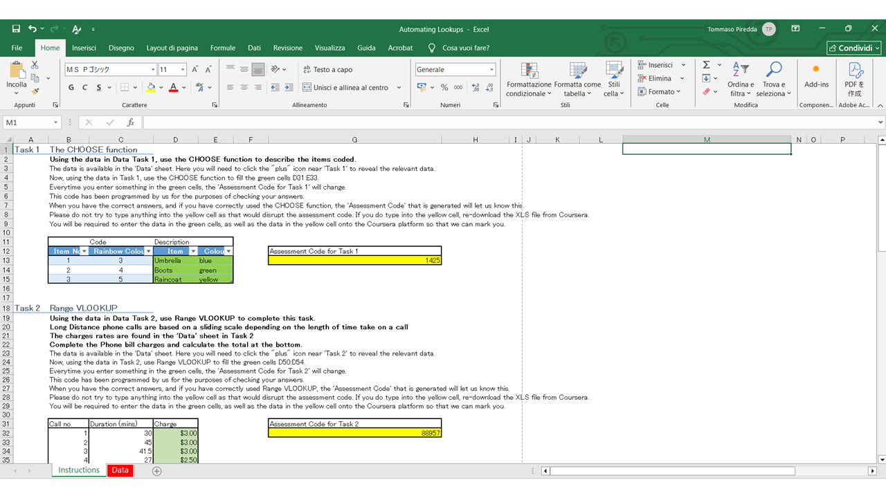

# Excel-Automating-Lookups
Applying following functions CHOOSE, VLOOKUP, INDEX, MATCH on worksheet.

# To-Do List
- Using the data in Data Task 1, use the CHOOSE function to describe the items coded. The data is available in the 'Data' sheet. Here you will need to click the "plus" icon near 'Task 1' to reveal the relevant data.  Now, using the data in Task 1, use the CHOOSE function to fill the green cells D31:E33.
- Using the data in Data Task 2, use Range VLOOKUP to complete this task. Long Distance phone calls are based on a sliding scale depending on the length of time take on a call. The charges rates are found in the 'Data' sheet in Task 2. 
- At a fast food Café, the waitress went round and took down the orders for a large group of 10. Use VLOOKUP with exact matching to complete the table. Make any adjustment to the items wherever necessary. Calculate the Grand Total for the party of 10. The data is available in the Data sheet. Here you will need to click the "plus" icon near 'Task 3' to reveal the relevant data. Now, using the data in Task 3, use Exact Match VLOOKUP to fill the green cells C72:C82.
- An outdoor clothing and accessories store placed prices on items according to the colours in demand for the item as per table in Data Task 4. Using the INDEX and MATCH functions, find the prices on these three items. The data is available in the Data sheet. Here you will need to click the "plus" icon near 'Task 4' to reveal the relevant data.	 Now, using the data in Task 4, use INDEX and MATCH to fill the green cells D99:D101.	

## Preview

